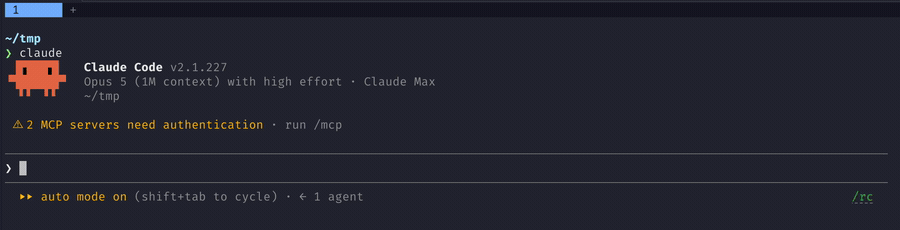

<h1 align="center">herdr auto title</h1>

<p align="center">
  Claude Code / Codex の会話内容から短いタイトルを自動生成して、<a href="https://herdr.dev">herdr</a> のタブ名に反映する hook。
</p>

<p align="center">
  <a href="#インストール">インストール</a> · <a href="#タイトルの言語">タイトルの言語</a> · <a href="#アンインストール">アンインストール</a> · <a href="https://herdr.dev">herdr.dev</a>
</p>

<p align="center">
  <a href="README.md">English</a> · 日本語
</p>

<p align="center">
  <a href="LICENSE"></a>
  <a href="https://github.com/sh1ma/herdr-auto-title/stargazers"></a>
  <a href="https://x.com/sh1ma"></a>
</p>

---

<p align="center">
  
</p>

タイトルの生成は呼び出し元と同じ CLI に投げる。Claude Code なら `claude -p`、Codex なら `codex exec`。

## 必要なもの

- herdr のペイン内で動いている Claude Code か Codex（`HERDR_ENV=1` が立っていること）
- `python3`（標準ライブラリのみ使用）
- `PATH` の通った `claude` か `codex`

herdr の外で起動された場合は何もせずに終了する。

## インストール

```sh
git clone https://github.com/sh1ma/herdr-auto-title
cd herdr-auto-title
./install.sh              # 入っているエージェント全部に入れる
./install.sh --codex      # 片方だけにするとき
```

スクリプトを置き、`UserPromptSubmit` に登録する。

| | スクリプト | 登録先 |
| --- | --- | --- |
| Claude Code | `~/.claude/hooks/herdr-auto-title.py` | `~/.claude/settings.json` |
| Codex | `~/.codex/hooks/herdr-auto-title.py` | `~/.codex/hooks.json` |

（`CLAUDE_CONFIG_DIR` / `CODEX_HOME` が設定されていればそちらを見る）

既存の hook 設定は保持し、再実行しても登録が重複しない。書き換え前の設定は `.bak` に残る。

反映されるのは **次に起動するセッションから**。

Codex は未確認の hook を実行しない。初回起動時のレビュー画面か `/hooks` で信頼すると動き出す（信頼の対象は登録されたコマンド文字列なので、置き場所を変えない限り再インストールしても確認し直しにはならない）。

## タイトルの言語

タイトルは英語で書かれる。ただしロケールが日本語のとき——`LC_ALL` / `LC_MESSAGES` / `LANG` が `ja` で始まるとき——は日本語になる。

`HERDR_AUTO_TITLE_LANG` で固定できる。

| 値 | タイトルの言語 |
| --- | --- |
| `auto`（既定） | ロケールに従う |
| `en` | 英語 |
| `ja` | 日本語 |

hook を実行するエージェントの環境から読むので、そのエージェントを起動する場所で export する。たとえば `~/.zshrc` に:

```sh
export HERDR_AUTO_TITLE_LANG=ja
```

反映されるのは、その後に起動したセッションから。

## アンインストール

```sh
./install.sh --uninstall            # 両方から外す
./install.sh --uninstall --codex    # 片方だけ
```

登録を消し、置いたスクリプトを削除する。状態ファイル（`~/.claude/herdr-auto-title/`）は残るので、不要なら手で消す。

## バージョン

Calendar Versioning。`YYYY.0M.0D.MICRO` で、末尾は同じ日に何度リリースしても衝突しないための連番。

```
2026.08.13.0   その日の 1 回目
2026.08.13.1   同じ日の 2 回目
2026.08.14.0   日付が変われば 0 に戻る
```

入っているものを確かめるとき:

```sh
python3 ~/.claude/hooks/herdr-auto-title.py --version
```

## 開発

```sh
python3 -m unittest discover -s tests   # テスト
ruff check . && ruff format --check .   # lint / 整形
shellcheck install.sh
```

CI（`.github/workflows/ci.yml`）は push と pull request で、上記に加えて `install.sh` の install → 冪等性 → uninstall を Python 3.9〜3.13 で確かめる。

リリースは Actions の **Release** ワークフローを手で流す。バージョンは既存タグと当日の日付（`Asia/Tokyo`）から決まるので、番号を指定する必要はない。ワークフローは `__version__` の書き換え、コミット、タグ push、GitHub Release の作成までやる。次に付く番号だけ知りたいときは `dry_run` を on にするか、手元で:

```sh
python3 scripts/calver.py next
```

## ライセンス

MIT
